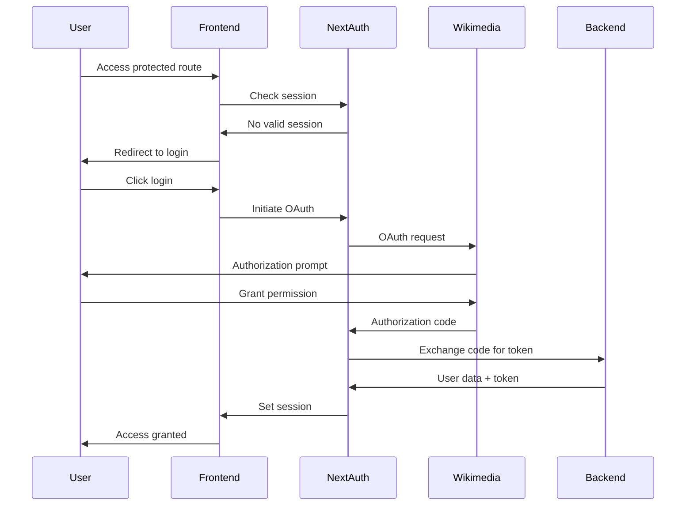
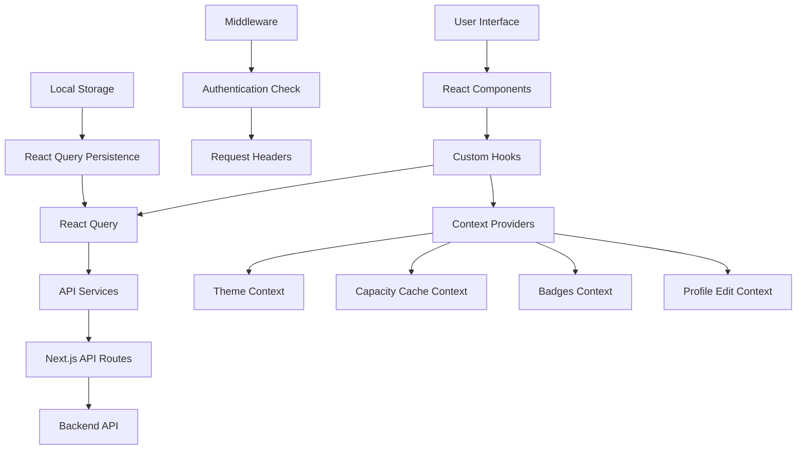
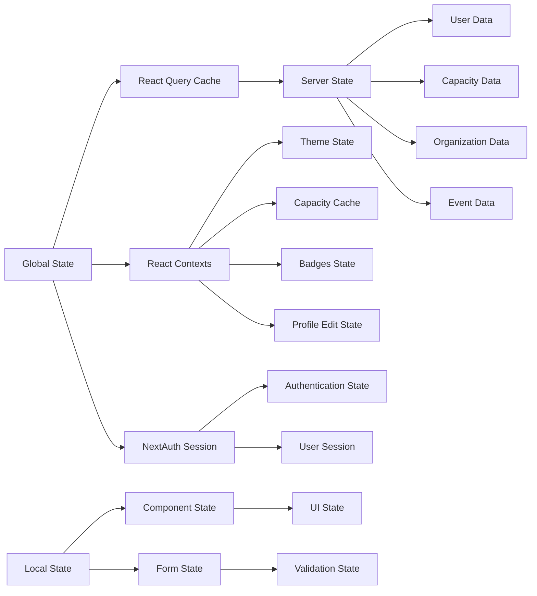
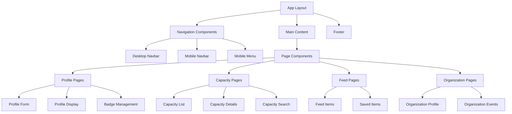

#  The Capacity Exchange

The Capacity Exchange (CapX) is a project focusing on [Global Approaches to Local Skills Development](https://meta.wikimedia.org/wiki/Movement_Strategy/Initiatives/Global_Approach_for_Local_Skill_Development) within and for the Wikimedia Movement. It establishes a sociotechnical platform for peer-to-peer connection and knowledge sharing to sustainably enable community-based capacity-building.

The aim is to create a methodology and service, which will serve as the structure for initiating mutual skills development globally, regionally, and locally. An interactive, online platform, backed by a database, will enable wikimedians to publish information about themselves, their affiliates, and informal groups. They will also be able to conduct searches, access information and to connect with each other in a way that reflects the Wiki's spirit and the Wikimedia Movement Strategy.

The Capacity Exchange (CapX) is available in Toolforge at https://capx.toolforge.org

## Table of Contents

- [Getting Started](#getting-started)
  - [Prerequisites](#prerequisites)
  - [Installation](#installation)
- [Project Architecture](#project-architecture)
- [Features](#features)
- [Testing](#testing)
- [Storybook](#storybook)
- [Development](#development)
- [Contributing](#contributing)
- [License](#license)

## Getting Started

### Prerequisites

Before you begin, ensure you have met the following requirements:

- NodeJS >=18
- Yarn package manager

### Installation

1. Clone the repository:

   ```bash
   git clone https://github.com/WikiMovimentoBrasil/capx-frontend.git
   ```

2. Navigate to the project directory:

   ```bash
   cd capx-frontend
   ```

3. Install project dependencies:

   ```bash
   yarn install
   ```

4. Rename the `.env.example` file to `.env` and comment the following lines in order to use the development server:

   ```bash
   LOGIN_STEP01_URL="https://capx-backend.toolforge.org/api/login/social/knox/mediawiki/"
   LOGIN_STEP02_URL="https://meta.wikimedia.org/wiki/Special:OAuth/authorize"
   LOGIN_STEP03_URL="https://capx-backend.toolforge.org/api/login/social/knox_user/mediawiki/"
   BASE_URL="https://capx-backend.toolforge.org"
   ```

5. Start the development server:

   ```bash
   yarn dev
   ```

You should now be able to access the project at http://localhost:3000/ in your web browser.

## Project Architecture

The project uses Next.js 14+ App Router and TypeScript for better type safety and modern routing patterns.

```
capx-frontend/
├── src/
│ ├── app/ # App Router directory
│ │ ├── (auth)/ # Authenticated routes group
│ │ │ ├── profile/ # Profile management pages
│ │ │ ├── capacity/ # Capacity management pages
│ │ │ ├── feed/ # Activity feed and saved items
│ │ │ ├── home/ # Dashboard home
│ │ │ ├── message/ # Messaging system
│ │ │ ├── organization_profile/ # Organization profiles
│ │ │ └── report_bug/ # Bug reporting
│ │ ├── events/ # Public events pages
│ │ ├── organization_list/ # Public organization listing
│ │ ├── terms/ # Terms of service
│ │ ├── privacy_policy/ # Privacy policy
│ │ ├── oauth/ # OAuth authentication
│ │ ├── api/ # API routes
│ │ └── layout.tsx # Root layout
│ ├── components/ # Shared components (50+ components)
│ ├── hooks/ # Custom hooks (35+ hooks)
│ ├── contexts/ # React contexts for state management
│ ├── services/ # API services (23+ services)
│ ├── types/ # TypeScript type definitions
│ ├── lib/ # Utility functions
│ ├── stories/ # Storybook stories
│ ├── __tests__/ # Test files
│ └── middleware.ts # Next.js middleware
├── public/ # Static files
├── locales/ # i18n files
├── .storybook/ # Storybook configuration
└── __mocks__/ # Jest mocks
```

## Features

### 🔐 Authentication & Authorization

- OAuth integration with Wikimedia accounts
- Session management with NextAuth.js
- Protected routes with middleware
- Role-based access control

### 👤 User Management

- **Profile Management**: Complete user profiles with avatars, skills, and territories
- **Profile Editing**: Rich form-based profile editing with validation
- **User Discovery**: Search and browse user profiles
- **Badges System**: Achievement badges with selection and display
- **Let's Connect**: User connection and networking features

### 🎯 Capacity Management

- **Capacity Profiles**: Detailed capacity information and management
- **Capacity Search**: Advanced search and filtering capabilities
- **Capacity Categories**: Hierarchical capacity organization
- **Known/Available/Wanted**: Three-tier capacity classification system
- **Capacity Feed**: Activity feed for capacity-related updates

### 🏢 Organization Features

- **Organization Profiles**: Comprehensive organization management
- **Organization Types**: Different types of organizations support
- **Organization Events**: Event management for organizations
- **Organization Discovery**: Public organization listing and search

### 📅 Events System

- **Event Management**: Create, edit, and manage events
- **Event Discovery**: Browse and search events
- **Wikidata Integration**: Enhanced event data from Wikidata
- **Event Categories**: Organized event classification

### 💬 Communication

- **Messaging System**: Direct messaging between users
- **Message Management**: Message history and organization
- **Notifications**: Real-time communication updates

### 📊 Content Management

- **Feed System**: Personalized activity feeds
- **Saved Items**: Bookmark and save content for later
- **Projects**: Project management and collaboration
- **Documents**: Document sharing and management

### 🌐 Internationalization

- **Multi-language Support**: Full i18n implementation
- **Language Selection**: Dynamic language switching
- **Territory Management**: Geographic region support

### 🎨 UI/UX Features

- **Dark Mode**: Complete dark/light theme support
- **Responsive Design**: Mobile-first responsive layout
- **Progressive Web App**: PWA capabilities
- **Accessibility**: WCAG compliant components
- **Modern UI**: Beautiful, modern interface with Tailwind CSS

### 🔧 Developer Features

- **TypeScript**: Full type safety throughout the application
- **Error Boundaries**: Graceful error handling
- **Loading States**: Comprehensive loading state management
- **Caching**: Intelligent data caching with React Query
- **Performance**: Optimized performance with Next.js features

## Testing

The project includes comprehensive testing setup with Jest and React Testing Library.

### Running Tests

```bash
# Run all tests
yarn test

# Run tests in watch mode
yarn test --watch

# Run tests with coverage
yarn test --coverage
```

### Test Structure

- **Component Tests**: Located in `src/__tests__/components/`
- **Route Tests**: Located in `src/__tests__/routes/`
- **Test Configuration**: `jest.config.ts` and `jest.setup.ts`

### Current Test Coverage

The project includes tests for:

- UI Components (16+ component tests)
- Navigation components
- Form components
- Authentication flows
- Capacity management
- Profile management

## Storybook

Storybook is configured for component development and documentation.

### Running Storybook

```bash
# Start Storybook development server
yarn storybook

# Build Storybook for production
yarn build-storybook
```

### Storybook Features

- Component documentation and examples
- Interactive component playground
- Visual regression testing capabilities
- Accessibility testing integration

### Current Stories

- Authentication components
- Progress indicators
- Form components
- Navigation components

## Authentication Flow



## Data Flow Architecture



## State Management Architecture



## API Architecture

```mermaid
graph TD
    A[Frontend] --> B[Next.js API Routes]

    B --> C[/api/auth/*]
    B --> D[/api/profile/*]
    B --> E[/api/capacity/*]
    B --> F[/api/events/*]
    B --> G[/api/organizations/*]
    B --> H[/api/messages/*]
    B --> I[/api/badges/*]
    B --> J[/api/users/*]

    C --> K[Authentication Service]
    D --> L[Profile Service]
    E --> M[Capacity Service]
    F --> N[Event Service]
    G --> O[Organization Service]
    H --> P[Message Service]
    I --> Q[Badge Service]
    J --> R[User Service]

    K --> S[Backend API]
    L --> S
    M --> S
    N --> S
    O --> S
    P --> S
    Q --> S
    R --> S
```

## Component Architecture



## Development

### Available Scripts

```bash
# Development
yarn dev              # Start development server
yarn build            # Build for production
yarn start            # Start production server
yarn lint             # Run ESLint

# Testing
yarn test             # Run tests
yarn test --watch     # Run tests in watch mode
yarn test --coverage  # Run tests with coverage

# Storybook
yarn storybook        # Start Storybook dev server
yarn build-storybook  # Build Storybook
```

### Development Guidelines

1. **TypeScript**: All new code should be written in TypeScript
2. **Testing**: Write tests for new components and features
3. **Storybook**: Create stories for new UI components
4. **Accessibility**: Ensure components are accessible
5. **Performance**: Optimize for performance and bundle size
6. **Documentation**: Document complex logic and APIs

### Code Quality Tools

- **ESLint**: Code linting and style enforcement
- **TypeScript**: Static type checking
- **Jest**: Unit and integration testing
- **React Testing Library**: Component testing utilities
- **Storybook**: Component documentation and testing

## Environment Variables

```env
# Authentication
NEXTAUTH_URL=http://localhost:3000
NEXTAUTH_SECRET=your-secret-key

# API Configuration
BASE_URL=http://localhost:8000
LOGIN_STEP01_URL=https://capx-backend.toolforge.org/api/login/social/knox/mediawiki/
LOGIN_STEP02_URL=https://meta.wikimedia.org/wiki/Special:OAuth/authorize
LOGIN_STEP03_URL=https://capx-backend.toolforge.org/api/login/social/knox_user/mediawiki/

# Optional: Development flags
NODE_ENV=development
```

## Performance Optimizations

- **Code Splitting**: Automatic code splitting with Next.js
- **Image Optimization**: Next.js Image component for optimized images
- **Caching**: React Query for intelligent data caching
- **Bundle Analysis**: Webpack bundle analyzer integration
- **Lazy Loading**: Component lazy loading for better performance

## Contributing

Contributions are welcome! To contribute to the Capacity Exchange, follow these steps:

1. Fork the repository
2. Create a new branch: `git checkout -b feature/your-feature`
3. Make your changes and commit them: `git commit -m 'Add some feature'`
4. Write tests for your changes
5. Ensure all tests pass: `yarn test`
6. Create Storybook stories if applicable
7. Push to the branch: `git push origin feature/your-feature`
8. Create a pull request on GitHub against the 'dev' branch

### Contribution Guidelines

- Follow the existing code style and conventions
- Write comprehensive tests for new features
- Update documentation as needed
- Ensure accessibility compliance
- Test across different browsers and devices

## License

This project is licensed under the GNU AGPLv3 - see the LICENSE file for details.

---

For more detailed information about specific features, check the documentation in the respective directories or explore the Storybook documentation.
