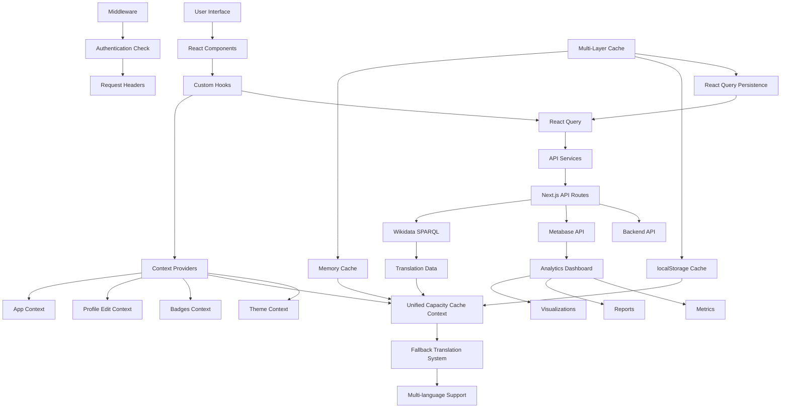
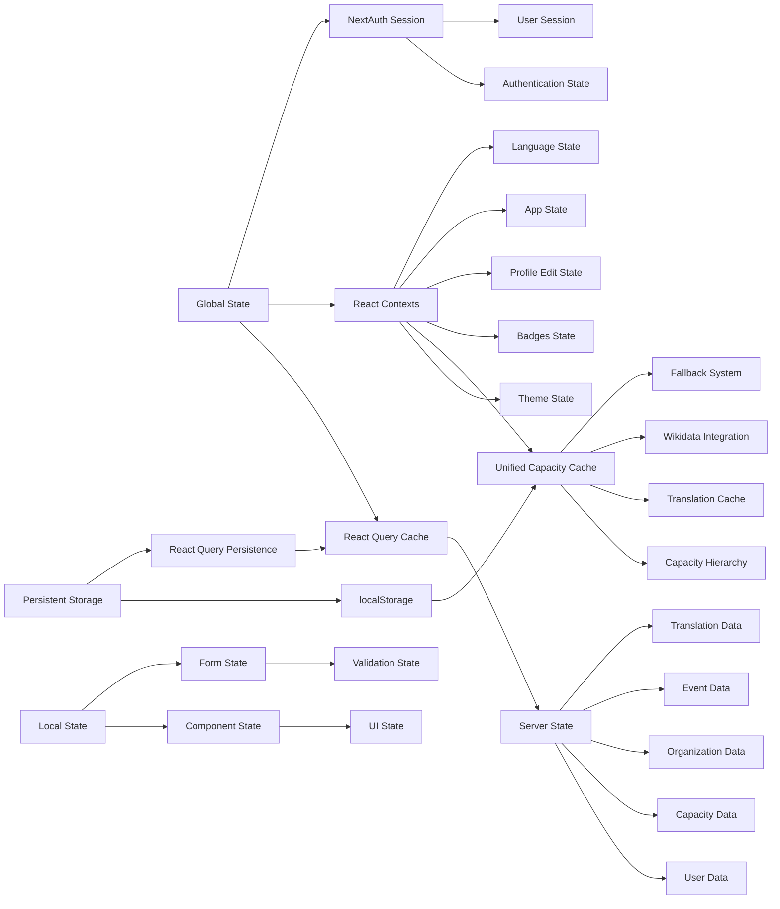
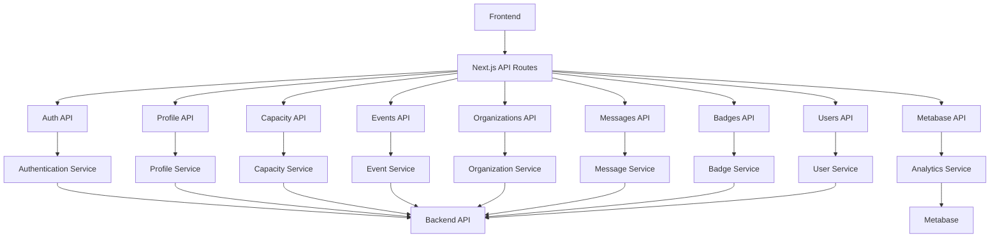
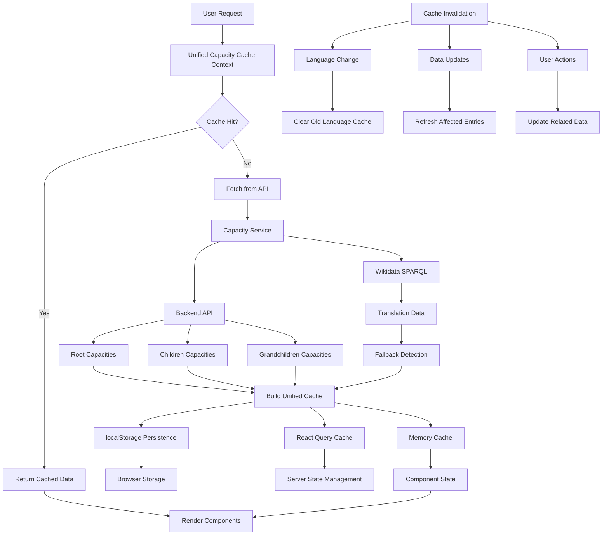
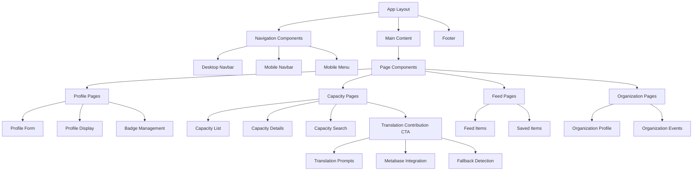

#  The Capacity Exchange

The Capacity Exchange (CapX) is a project focusing on [Global Approaches to Local Skills Development](https://meta.wikimedia.org/wiki/Movement_Strategy/Initiatives/Global_Approach_for_Local_Skill_Development) within and for the Wikimedia Movement. It establishes a sociotechnical platform for peer-to-peer connection and knowledge sharing to sustainably enable community-based capacity-building.

The aim is to create a methodology and service, which will serve as the structure for initiating mutual skills development globally, regionally, and locally. An interactive, online platform, backed by a database, will enable wikimedians to publish information about themselves, their affiliates, and informal groups. They will also be able to conduct searches, access information and to connect with each other in a way that reflects the Wiki's spirit and the Wikimedia Movement Strategy.

The Capacity Exchange (CapX) is available in Toolforge at https://capx.toolforge.org

## Table of Contents

- [Getting Started](#getting-started)
  - [Prerequisites](#prerequisites)
  - [Installation](#installation)
- [Project Architecture](#project-architecture)
- [Features](#features)
- [Testing](#testing)
- [Storybook](#storybook)
- [Development](#development)
- [Contributing](#contributing)
- [License](#license)

## Getting Started

### Prerequisites

Before you begin, ensure you have met the following requirements:

- NodeJS >=18
- Yarn package manager

### Installation

1. Clone the repository:

   ```bash
   git clone https://github.com/WikiMovimentoBrasil/capx-frontend.git
   ```

2. Navigate to the project directory:

   ```bash
   cd capx-frontend
   ```

3. Install project dependencies:

   ```bash
   yarn install
   ```

4. Rename the `.env.example` file to `.env` and comment the following lines in order to use the development server:

   ```bash
   LOGIN_STEP01_URL="https://capx-backend.toolforge.org/api/login/social/knox/mediawiki/"
   LOGIN_STEP02_URL="https://meta.wikimedia.org/wiki/Special:OAuth/authorize"
   LOGIN_STEP03_URL="https://capx-backend.toolforge.org/api/login/social/knox_user/mediawiki/"
   BASE_URL="https://capx-backend.toolforge.org"
   ```

5. Start the development server:

   ```bash
   yarn dev
   ```

You should now be able to access the project at http://localhost:3000/ in your web browser.

## Project Architecture

The project uses Next.js 14+ App Router and TypeScript for better type safety and modern routing patterns.

```
capx-frontend/
├── src/
│ ├── app/ # App Router directory
│ │ ├── (auth)/ # Authenticated routes group
│ │ │ ├── profile/ # Profile management pages
│ │ │ ├── capacity/ # Capacity management pages
│ │ │ ├── feed/ # Activity feed and saved items
│ │ │ ├── home/ # Dashboard home
│ │ │ ├── message/ # Messaging system
│ │ │ ├── organization_profile/ # Organization profiles
│ │ │ └── report_bug/ # Bug reporting
│ │ ├── events/ # Public events pages
│ │ ├── organization_list/ # Public organization listing
│ │ ├── terms/ # Terms of service
│ │ ├── privacy_policy/ # Privacy policy
│ │ ├── oauth/ # OAuth authentication
│ │ ├── api/ # API routes
│ │ └── layout.tsx # Root layout
│ ├── components/ # Shared components (50+ components)
│ ├── hooks/ # Custom hooks (35+ hooks)
│ ├── contexts/ # React contexts for state management
│ ├── services/ # API services (23+ services)
│ ├── types/ # TypeScript type definitions
│ ├── lib/ # Utility functions
│ ├── stories/ # Storybook stories
│ ├── __tests__/ # Test files
│ └── middleware.ts # Next.js middleware
├── public/ # Static files
├── locales/ # i18n files
├── .storybook/ # Storybook configuration
└── __mocks__/ # Jest mocks
```

## Features

### 🔐 Authentication & Authorization

- OAuth integration with Wikimedia accounts
- Session management with NextAuth.js
- Protected routes with middleware
- Role-based access control

### 👤 User Management

- **Profile Management**: Complete user profiles with avatars, skills, and territories
- **Profile Editing**: Rich form-based profile editing with validation
- **User Discovery**: Search and browse user profiles
- **Badges System**: Achievement badges with selection and display
- **Let's Connect**: User connection and networking features

### 🎯 Capacity Management

- **Capacity Profiles**: Detailed capacity information and management
- **Capacity Search**: Advanced search and filtering capabilities
- **Capacity Categories**: Hierarchical capacity organization
- **Known/Available/Wanted**: Three-tier capacity classification system
- **Capacity Feed**: Activity feed for capacity-related updates

### 🏢 Organization Features

- **Organization Profiles**: Comprehensive organization management
- **Organization Types**: Different types of organizations support
- **Organization Events**: Event management for organizations
- **Organization Discovery**: Public organization listing and search

### 📅 Events System

- **Event Management**: Create, edit, and manage events
- **Event Discovery**: Browse and search events
- **Wikidata Integration**: Enhanced event data from Wikidata
- **Event Categories**: Organized event classification

### 💬 Communication

- **Messaging System**: Direct messaging between users
- **Message Management**: Message history and organization
- **Notifications**: Real-time communication updates

### 📊 Content Management

- **Feed System**: Personalized activity feeds
- **Saved Items**: Bookmark and save content for later
- **Projects**: Project management and collaboration
- **Documents**: Document sharing and management
- **Analytics**: Comprehensive data analytics through Metabase integration

### 🌐 Internationalization

- **Translatewiki.net Integration**: Community-driven translations through [translatewiki.net](https://translatewiki.net/)
- **Advanced Translation System**: Multi-layered translation with Wikidata and Metabase SPARQL integration
- **Intelligent Fallback**: Automatic fallback to English when translations are unavailable
- **Translation Contribution CTA**: Built-in prompts encouraging community translation contributions
- **Language Selection**: Dynamic language switching with persistent preferences
- **Territory Management**: Geographic region support
- **Collaborative Translation**: Open source translation community with over 18k translators
- **Multi-language Support**: Support for 30+ active languages
- **Capacity Translation Cache**: Specialized caching system for capacity translations across all languages

### 📈 Analytics & Reporting

- **Metabase Integration**: Advanced analytics and data visualization
- **Custom Dashboards**: Configurable metrics and KPIs
- **Data Export**: Export capabilities for further analysis
- **Real-time Metrics**: Live tracking of platform usage
- **Community Insights**: Analytics for community engagement and growth

### 🔄 Advanced Caching System

The application features a sophisticated multi-layered caching system designed for optimal performance and user experience:

**Unified Capacity Cache**
- **Hierarchical Data Management**: Efficiently stores and retrieves capacity hierarchies (root → children → grandchildren)
- **Multi-language Support**: Separate cache entries for each language with intelligent fallback
- **Translation Integration**: Seamless integration with Wikidata SPARQL for enhanced translation data
- **localStorage Persistence**: Automatic persistence across browser sessions
- **Cache Invalidation**: Smart cache management with automatic cleanup and updates

**Translation Fallback System**
- **Intelligent Detection**: Automatically detects when translations are unavailable
- **Contribution Prompts**: Built-in CTA components encouraging community translation contributions
- **Metabase Integration**: Direct links to translation platforms for easy contribution
- **Performance Optimized**: Minimal impact on application performance through efficient caching

**Cache Performance Features**
- **Batch Processing**: Efficient bulk operations for cache updates
- **Memory Management**: Automatic cleanup of stale cache entries
- **Background Updates**: Non-blocking cache refreshes
- **Error Resilience**: Graceful handling of cache failures with automatic fallbacks

### 🎨 UI/UX Features

- **Dark Mode**: Complete dark/light theme support
- **Responsive Design**: Mobile-first responsive layout
- **Accessibility**: WCAG compliant components
- **Modern UI**: Beautiful, modern interface with Tailwind CSS

### 🔧 Developer Features

- **TypeScript**: Full type safety throughout the application
- **Error Boundaries**: Graceful error handling
- **Loading States**: Comprehensive loading state management
- **Advanced Caching System**: Multi-layered caching with React Query, localStorage persistence, and intelligent cache invalidation
- **Performance**: Optimized performance with Next.js features, code splitting, and lazy loading
- **Translation Fallback System**: Sophisticated multi-language support with automatic fallback to English when translations are unavailable

## Testing

The project includes comprehensive testing setup with Jest and React Testing Library, achieving excellent test coverage across all major features.

### Running Tests

```bash
# Run all tests
yarn test

# Run tests in watch mode
yarn test --watch

# Run tests with coverage
yarn test --coverage

# Format code
yarn format

# Lint code
yarn lint
```

### Test Structure

- **Component Tests**: Located in `src/__tests__/components/` (25+ component test suites)
- **Service Tests**: Located in `src/__tests__/services/` (API and service layer tests)
- **Utility Tests**: Located in `src/__tests__/utils/` (Helper function tests)
- **Hook Tests**: Integration tests for custom React hooks
- **Test Configuration**: `jest.config.ts` and `jest.setup.ts`

### Test Coverage Statistics

- **Total Test Suites**: 32
- **Total Tests**: 343+
- **Pass Rate**: 99%+ (342/343 tests passing)
- **Coverage Areas**: All major components and features

### Comprehensive Test Coverage

The project includes tests for:

**Core Components & UI**
- Authentication components (AuthButton, login flows)
- Navigation (DesktopNavbar, MobileNavbar, MobileMenu)
- Form components (BaseButton, ProgressBar, language/profile selects)
- Layout components (MainSection, CallToActionSection, StatisticsSection)

**Feature-Specific Components**
- **Capacity Management**: CapacityCard, CapacitySearch, CapacitySelectionModal, CapacityFeedCard, CapacityListMainWrapper
- **Profile Management**: AvatarSelectionPopup, MiniBio, MiniBioTextarea, ProfileLanguageSwitching
- **Organization Management**: OrganizationProfileEditDocuments, DocumentFormItem
- **Event Management**: EventsEditForm with comprehensive validation
- **Translation System**: TranslationContributeCTA with dark mode and responsive design

**Services & Utilities**
- **API Services**: metabaseService with Wikidata integration
- **Utility Functions**: capacityValidation, convertWikimediaUrl, fetchWikimediaData, getProfileImage
- **Infrastructure**: axios-interceptor for API communication

**Advanced Features**
- Cache management and invalidation
- Multi-language translation fallbacks
- Dark mode support
- Mobile-responsive design
- Accessibility compliance
- Error boundary handling


## Storybook

Storybook is configured for component development and documentation. It is used to create interactive stories for components and to test them in isolation. It is also used to document components and their props. We are outdated with the components implemented and the stories created.

### Running Storybook

```bash
# Start Storybook development server
yarn storybook

# Build Storybook for production
yarn build-storybook
```

### Storybook Features

- Component documentation and examples
- Interactive component playground
- Visual regression testing capabilities
- Accessibility testing integration

### Current Stories

- Authentication components
- Progress indicators
- Form components
- Navigation components

## Authentication Flow


## Data Flow Architecture



## State Management Architecture



## API Architecture



## Cache Architecture



## Component Architecture



## Development

### Available Scripts

```bash
# Development
yarn dev              # Start development server
yarn build            # Build for production
yarn start            # Start production server

# Code Quality
yarn lint             # Run ESLint
yarn lint:fix         # Run ESLint with auto-fix
yarn format           # Format code with Prettier
yarn format:check     # Check code formatting

# Testing
yarn test             # Run tests
yarn test --watch     # Run tests in watch mode
yarn test --coverage  # Run tests with coverage

# Storybook
yarn storybook        # Start Storybook dev server
yarn build-storybook  # Build Storybook
```

### Development Guidelines

1. **TypeScript**: All new code should be written in TypeScript
2. **Testing**: Write tests for new components and features
3. **Storybook**: Create stories for new UI components
4. **Accessibility**: Ensure components are accessible
5. **Performance**: Optimize for performance and bundle size
6. **Documentation**: Document complex logic and APIs

### Code Quality Tools

- **ESLint**: Code linting and style enforcement
- **TypeScript**: Static type checking
- **Jest**: Unit and integration testing
- **React Testing Library**: Component testing utilities
- **Storybook**: Component documentation and testing

## Environment Variables

```env
# Authentication
NEXTAUTH_URL=http://localhost:3000
NEXTAUTH_SECRET=your-secret-key

# API Configuration
BASE_URL=http://localhost:8000
LOGIN_STEP01_URL=https://capx-backend.toolforge.org/api/login/social/knox/mediawiki/
LOGIN_STEP02_URL=https://meta.wikimedia.org/wiki/Special:OAuth/authorize
LOGIN_STEP03_URL=https://capx-backend.toolforge.org/api/login/social/knox_user/mediawiki/

# Optional: Development flags
NODE_ENV=development
```

## Performance Optimizations

- **Advanced Multi-Layer Caching**:
  - **Unified Capacity Cache**: Intelligent caching system with localStorage persistence
  - **React Query Cache**: Server state management with automatic background updates
  - **Translation Cache**: Specialized caching for multi-language capacity data
  - **Wikidata Integration Cache**: Cached SPARQL queries for translation metadata

- **Code Splitting**: Automatic code splitting with Next.js
- **Image Optimization**: Next.js Image component for optimized images
- **Bundle Analysis**: Webpack bundle analyzer integration
- **Lazy Loading**: Component lazy loading for better performance
- **Cache Invalidation**: Intelligent cache management and cleanup
- **Persistent Query Cache**: React Query persistence for offline-first experience
- **Optimized Data Fetching**: Batch requests and parallel API calls where possible

## Contributing

Contributions are welcome! To contribute to the Capacity Exchange, follow these steps:

1. Fork the repository
2. Create a new branch: `git checkout -b feature/your-feature`
3. Make your changes and commit them: `git commit -m 'Add some feature'`
4. Write tests for your changes
5. Ensure all tests pass: `yarn test`
6. Create Storybook stories if applicable
7. Push to the branch: `git push origin feature/your-feature`
8. Create a pull request on GitHub against the 'dev' branch

### Contribution Guidelines

- Follow the existing code style and conventions
- Write comprehensive tests for new features
- Update documentation as needed
- Ensure accessibility compliance
- Test across different browsers and devices

## License

This project is licensed under the GNU AGPLv3 - see the LICENSE file for details.

---

For more detailed information about specific features, check the documentation in the respective directories or explore the Storybook documentation.
